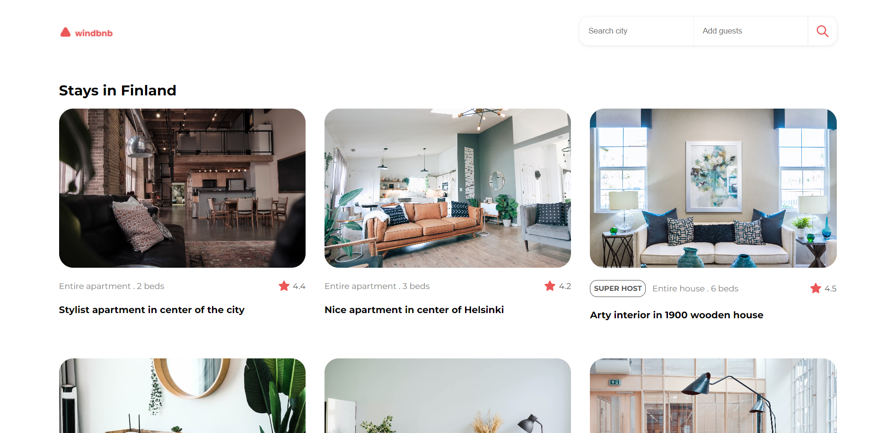

<!-- Please update value in the {}  -->

<h1 align="center">Windbnb by Marc Fontova</h1>

<div align="center">
   Solution for a challenge from  <a href="http://devchallenges.io" target="_blank">Devchallenges.io</a>.
</div>

<div align="center">
  <h3>
    <a href="https://windbnb-g630.onrender.com/">
      Demo
    </a>
    <span> | </span>
    <a href="https://github.com/MFontova/windbnb">
      Solution
    </a>
    <span> | </span>
    <a href="https://devchallenges.io/challenges/3JFYedSOZqAxYuOCNmYD">
      Challenge
    </a>
  </h3>
</div>

<!-- TABLE OF CONTENTS -->

## Table of Contents

- [Overview](#overview)
  - [Built With](#built-with)
- [Features](#features)
- [How to use](#how-to-use)
- [Contact](#contact)

<!-- OVERVIEW -->

## Overview



Introduce your projects by taking a screenshot or a gif. Try to tell visitors a story about your project by answering:

- Where can I see your demo?
In the demo you can see a list of stays and filters section. In the filters you can search by location and by number of guests.
- What was your experience?
I enjoyed doing that challenge, because of the beauty of the design and the challenge of the filters.
- What have you learned/improved?
I learned that when you see any input, may be it's not as you think ;)
- Your wisdom? :)

### Built With

<!-- This section should list any major frameworks that you built your project using. Here are a few examples.-->

- [React](https://reactjs.org/)
- [styled components](https://styled-components.com/)

## Features

<!-- List the features of your application or follow the template. Don't share the figma file here :) -->

This application/site was created as a submission to a [DevChallenges](https://devchallenges.io/challenges) challenge. The [challenge](https://devchallenges.io/challenges/3JFYedSOZqAxYuOCNmYD) was to build an application to complete the given user stories.

## How To Use

<!-- Example: -->

To clone and run this application, you'll need [Git](https://git-scm.com) and [Node.js](https://nodejs.org/en/download/) (which comes with [npm](http://npmjs.com)) installed on your computer. From your command line:

```bash
# Clone this repository
$ git clone https://github.com/MFontova/windbnb

# Install dependencies
$ npm install

# Run the app
$ npm start
```

## Contact

- GitHub [@MFontova](https://{github.com/MFontova})
- LinkedIn [@mfontova](https://www.linkedin.com/in/mfontova/)
